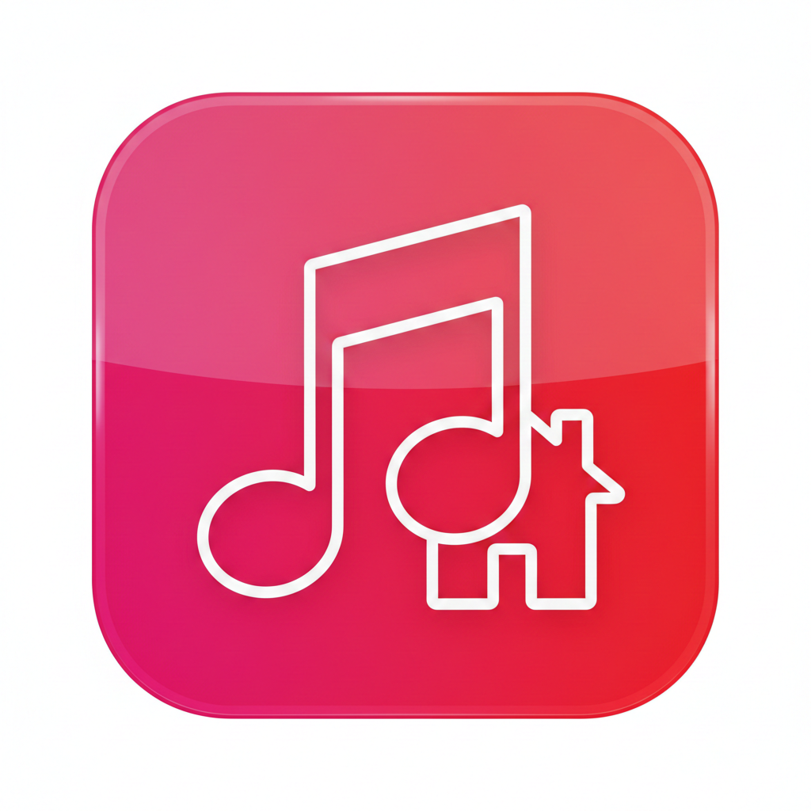

<div align="center">
  
</div>
# 🍎 Apple Music for Mac (Modern)


Apple Music for Mac (Modern) est une intégration fluide et élégante pour contrôler votre musique directement depuis votre tableau de bord **Home Assistant**.

---

## 🧐 Qu'est-ce que c'est ?
Cette intégration fait le pont entre votre Mac et Home Assistant. Elle vous permet de piloter la lecture et d'afficher des informations riches comme les pochettes d'album en haute définition.

### ✨ Fonctionnalités
* 🛠 **Contrôle complet** : Lecture, Pause, Suivant, Précédent.
* 🔊 **Gestion du volume** : Réglage précis du son de l'application Musique.
* 🖼 **Artwork HD** : Récupération automatique de la pochette via iTunes API.
* 🎶 **Infos Live** : Titre, Artiste et Album mis à jour en temps réel.
* 🚀 **Zéro latence** : Communication directe via un serveur local léger.

---

## 🛠 Installation

### 1️⃣ Prérequis sur le Mac
1. **Node.js** doit être installé sur votre machine.
2. Créez un dossier nommé `apple-music-modern`.
3. Installez les dépendances : `npm install express`.

### 2️⃣ Installation dans Home Assistant
* **Via HACS** : Ajoutez ce dépôt en tant que *Custom Repository*.
* **Téléchargement** : Cliquez sur installer et **redémarrez Home Assistant**.
* **Configuration** : Allez dans *Paramètres* → *Appareils et services* → *Ajouter l'intégration*.
* Entrez l'**IP de votre Mac** et le port `8181`.

---

## 🖥️ Configuration du Serveur (Mac)

Pour que l'intégration fonctionne, le fichier `server.js` doit tourner sur votre Mac. 

1. Copiez le code ci-dessous dans un fichier `server.js`.
2. Lancez-le avec : `node server.js`

<details>
<summary>👉 Cliquez pour voir le code du serveur (server.js)</summary>

```javascript
const express = require('express');
const { exec } = require('child_process');
const app = express();

app.use(express.json());

app.get('/now_playing', (req, res) => {
    const script = `
        tell application "Music"
            if it is running then
                set tName to name of current track
                set tArtist to artist of current track
                set tAlbum to album of current track
                set tVol to sound volume
                set tState to player state as text
                return "{\\"player_state\\": \\"" & tState & "\\", \\"name\\": \\"" & tName & "\\", \\"artist\\": \\"" & tArtist & "\\", \\"album\\": \\"" & tAlbum & "\\", \\"volume\\": " & tVol & "}"
            else
                return "{\\"player_state\\": \\"stopped\\"}"
            end if
        end tell
    `;
    exec(\`osascript -e '\${script}'\`, (error, stdout) => {
        try { res.send(JSON.parse(stdout.trim())); } 
        catch (e) { res.send({ player_state: "stopped" }); }
    });
});

app.put('/play', (req, res) => exec('osascript -e "tell application \\"Music\\" to play"', () => res.send({status:"ok"})));
app.put('/pause', (req, res) => exec('osascript -e "tell application \\"Music\\" to pause"', () => res.send({status:"ok"})));
app.put('/next', (req, res) => exec('osascript -e "tell application \\"Music\\" to next track"', () => res.send({status:"ok"})));
app.put('/previous', (req, res) => exec('osascript -e "tell application \\"Music\\" to previous track"', () => res.send({status:"ok"})));
app.put('/volume', (req, res) => {
    const vol = req.body.level;
    exec(\`osascript -e "tell application \\"Music\\" to set sound volume to \${vol}"\`, () => res.send({status:"ok"}));
});

app.listen(8181, () => console.log('Moteur Apple Music prêt sur 8181 !'));
</details>

🔐 Autorisations macOS (Important)
Pour que le serveur puisse lire les infos de Musique, vous devez donner une autorisation :

Réglages Système → Confidentialité et sécurité → Automatisation.

Cochez la case Musique sous l'application Terminal.

Pour tester, lancez : osascript -e 'tell application "Music" to get name of current track'

🤝 Crédits
Développé par @adrianleguern.
Inspiré par le besoin d'une intégration macOS moderne pour Home Assistant.
